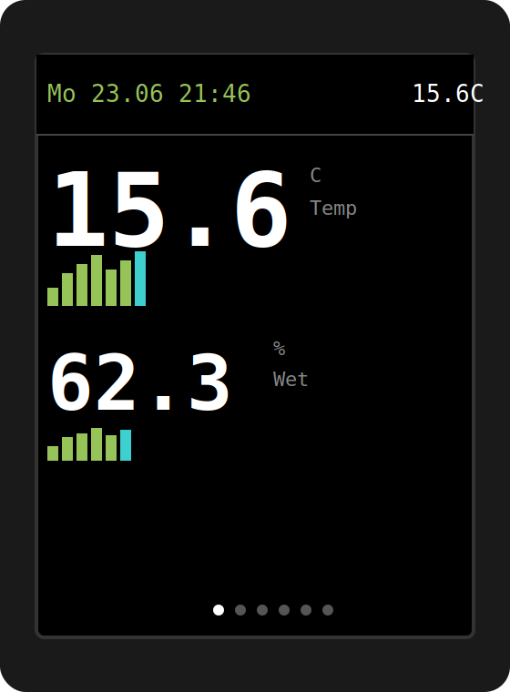
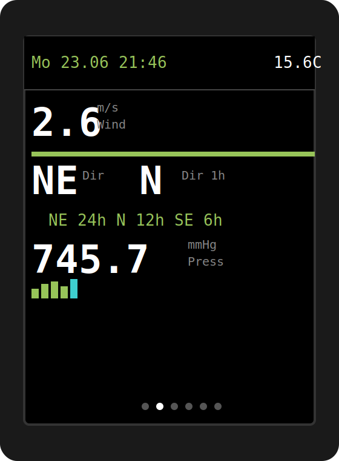
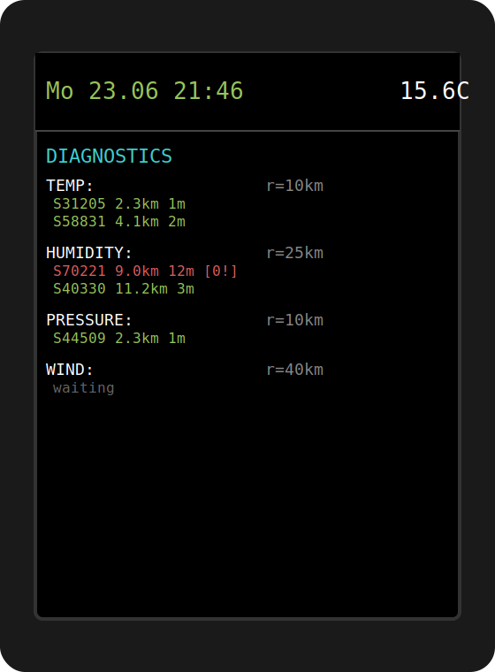

# Weather display v3 — ESP32 + ST7789 (narodmon.ru + Yandex.Weather)

A standalone ESP32 weather display that combines readings from nearby public sensors on [narodmon.ru](https://narodmon.ru) with forecast data from Yandex.Weather, shown on a TFT screen as a carousel of 6 large, easy-to-read screens.

Author: **xumbax**

## Why v3

The previous version mixed in Open-Meteo as a third data source — this release drops it entirely in favor of a tighter two-source design: narodmon for hyper-local sensor data, Yandex.Weather for forecast. The sensor-discovery logic was also reworked to be adaptive rather than fixed, and wind direction got a proper vector-based "prevailing direction" treatment instead of a meaningless trend bar.

This release also went through a cleanup pass: a few functions and struct fields left over from earlier iterations (an unused GraphQL-era POST helper, an unused haversine-distance function, a couple of fields that were parsed but never displayed) were removed, and header/inline comments that had drifted out of sync with the actual code were corrected.

## Features

- **Adaptive search radius per parameter** — starts at 10 km, expands by 15 km steps (up to 100 km) only for parameter types still short on sensors, stops once 2 sensors are found. A value is shown on screen with just 1 sensor — N/D only when there are truly none nearby.
- **"Oldest data first" sensor polling** — instead of simple round-robin, every minute the 3 sensors with the stalest known readings are queried (narodmon's API limit is 3 sensors per request), with a 5-minute-per-sensor cooldown so a sensor isn't hammered just because it's technically "oldest".
- **Broken-zero sensor detection** — if 2+ sensors of the same type are fresh and one reads exactly 0.0 while another differs by more than a configurable threshold, the zero reading is excluded from averaging instead of skewing the result.
- **6 screens, grouped by meaning**: Temperature+Humidity, Wind+Direction+Pressure, Air Quality+Radiation+Precipitation, Yandex current+2h-ahead forecast, Yandex 2-day forecast, diagnostics.
- **Wind direction done right** — a vector sum of direction samples (not a naive average, which would turn 350° and 10° into "south") gives a proper prevailing direction. The screen shows current direction, the 1-hour vector average right next to it, and three text labels (24h/12h/6h) instead of a jittery trend bar.
- **Per-parameter alerts, not full-screen** — when a threshold is crossed, only that parameter's number turns red. The LED lights solid only while an alert screen is being shown; the buzzer beeps once per screen display, throttled to at most once every 15 minutes across all alerts combined.
- **Adaptive Yandex.Weather scheduling** — instead of a fixed interval, the next request is scheduled for exactly 30 minutes before the current "+2h" forecast slot expires, keeping the displayed forecast always within a tight, predictable margin while staying well under the free tier's 30 requests/day limit.
- **TTP223 touch button** — a tap forces screen 0 and opens a 30-second manual-navigation window; further taps within that window step through screens; after 30 seconds of inactivity the regular carousel resumes from wherever it was left.
- **No Cyrillic on screen** — TFT_eSPI's built-in font has no Cyrillic glyphs, so all on-screen text is English; logs to Serial Monitor remain in Russian for readability during setup.

## Screens

| Temp / Humidity | Wind / Direction / Pressure | Diagnostics |
|---|---|---|
|  |  |  |

*These images are illustrative mockups of the screen layout, not photos of an actual unit.*

## Hardware

- ESP32 DevKit (any WROOM-32 based board)
- 2.0" ST7789 TFT display, 240×320, SPI
- LED + 220 Ω resistor
- 5V active piezo buzzer
- TTP223 touch sensor module

## Setup

1. Arduino IDE + ESP32 board package
2. Libraries: `TFT_eSPI` (Bodmer), `ArduinoJson` v6 (Benoit Blanchon), `NTPClient` (Fabrice Weinberg)
3. Configure `User_Setup.h` in the `TFT_eSPI` library for an ST7789 240×320 display
4. Open `weather_display.ino` and fill in:
   - `WIFI_SSID`, `WIFI_PASS`
   - `NM_API_KEY` — narodmon.ru → Profile → My applications
   - `YANDEX_WEATHER_KEY` — Yandex developer console → Weather Data API → free "smart home" tier
   - `MY_LAT`, `MY_LON` — coordinates of your observation point
5. Flash, then open Serial Monitor at 115200 baud

## API limits and access notes

- **narodmon**: accessing more than 3 other people's public sensors per request requires support approval — this firmware respects the 3-per-request cap by design (`fetchOldestSensors` always queries at most 3 IDs at a time).
- **Yandex.Weather free tier**: 30 requests/day, forecast limited to today + tomorrow (not tomorrow + day-after, despite how that might sound — `limit=2` in their API means "today and tomorrow"). The adaptive scheduling in this firmware uses roughly 16 requests/day, comfortably under the cap.

## License

MIT — use, modify, and distribute freely.

## Acknowledgments

Data provided by [narodmon.ru](https://narodmon.ru) (crowdsourced environmental sensor network) and [Yandex.Weather](https://yandex.ru/dev/weather/).
