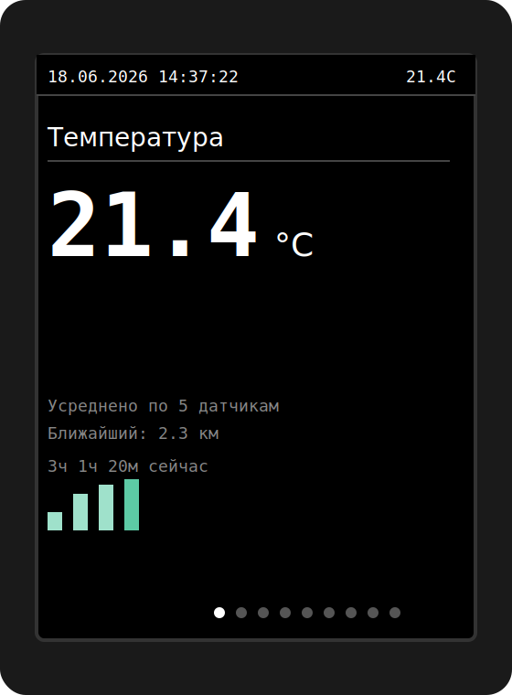
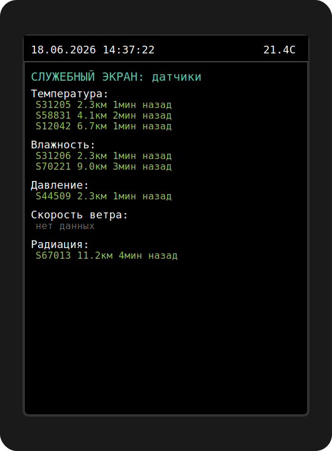
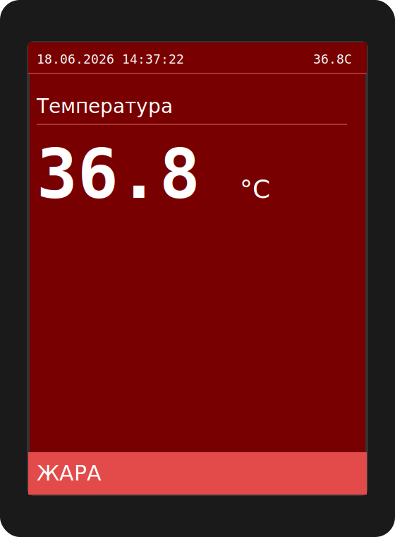

# Погодный дисплей на ESP32 + ST7789 (narodmon.ru + Яндекс.Погода)

Автономное устройство на ESP32, которое забирает показания ближайших публичных датчиков с проекта [narodmon.ru](https://narodmon.ru) (температура, влажность, давление, ветер, радиация, запылённость, осадки), усредняет их с весом по расстоянию, дополняет прогнозом от Яндекс.Погоды и показывает всё это на TFT-экране в виде карусели крупных, легко читаемых экранов. Все настройки — включая WiFi — редактируются через встроенный веб-интерфейс, без переподключения к компьютеру.

Автор: **xumbax**

## Зачем

Готовых метеостанций с такими данными по соседним датчикам в продаже не нашлось, а ставить свой собственный набор датчиков (термометр, барометр, анемометр, дозиметр) — избыточно, если рядом уже есть десятки чужих публичных приборов на narodmon. Идея — взять несколько ближайших датчиков каждого типа и усреднить их с весом по расстоянию, чтобы получить более устойчивый к выбросам результат, чем от одного случайного прибора, и дополнить это прогнозом от Яндекс.Погоды там, где соседских датчиков физически быть не может (прогноз на будущее).

## Возможности

- **8 параметров narodmon**: температура, влажность, давление, скорость и направление ветра, радиационный фон, запылённость воздуха, осадки
- **Взвешенное усреднение (IDW)** — `w = 1 / (d + ε)^p`, чем ближе датчик, тем больше его вес; число используемых датчиков, степень затухания и радиус поиска настраиваются без перепрошивки
- **Адаптивный радиус поиска** — старт с 10 км, расширение по 15 км, пока не наберётся 2 датчика на тип (потолок 100 км); значение на экране появляется уже при 1 датчике
- **Яндекс.Погода** (бесплатный тариф "для умного дома") — погода на момент запроса, ближайший прогнозный час к "+2 часа от сейчас" и прогноз на сегодня/завтра
- **Карусель из 6 экранов**, сгруппированных по смыслу: Темп+Влажность, Ветер+Направление+Давление, Качество воздуха+Радиация+Осадки, Яндекс сейчас/+2ч, Яндекс прогноз на 2 дня, служебный (диагностика + IP веб-интерфейса)
- **Тренд-бар на всю ширину экрана** — 32 столбика по 45 минут (24 часа охвата), привязаны к фиксированным отметкам времени суток, не к моменту включения устройства
- **Веб-интерфейс** — редактирование любой настройки, просмотр текущих показаний датчиков, лог за 5 минут; при первом включении без WiFi устройство само поднимает точку доступа для настройки (подробности ниже)
- **Тревоги** при выходе параметров за пороги (мороз/жара, шторм, радиация, пылевая буря, влажность) — точечно, красной становится только цифра конкретного параметра; светодиод горит непрерывно, пищалка раз в 15 минут
- **Светодиодная диагностика связи** — иерархия приоритетов: нет WiFi → мигает раз в 1 сек, есть WiFi но narodmon не отвечает → раз в 3 сек, отвечает, но нет датчиков → раз в 5 сек, всё хорошо → не горит
- **Сенсорная кнопка TTP223** — принудительное переключение экранов на 30 секунд, потом автокарусель продолжает с того места
- **Защитная перезагрузка** — если устройство 30+ минут не может выйти из проблемного состояния (WiFi/API/датчики), перезагружается само; во время настройки через точку доступа этот таймер не действует

## Веб-интерфейс

После того как устройство подключено к WiFi (обычным способом или через точку доступа при первой настройке — см. ниже), по его IP-адресу (виден на служебном экране карусели или в Serial Monitor при старте) доступны три вкладки:

| Вкладка | Адрес | Что там |
|---|---|---|
| Настройки | `/settings` | Все параметры прошивки (WiFi, ключи narodmon/Яндекс, координаты, пороги алертов, тайминги и т.д.) в виде формы. Сохранение перезагружает устройство. |
| Датчики | `/sensors` | Текущие значения по всем 8 параметрам, ID и возраст показаний использованных датчиков narodmon, данные Яндекса. Обновляется автоматически раз в 15 сек. |
| Логи | `/logs` | Строки лога за последние 5 минут (то же, что видно в Serial Monitor). Обновляется только по кнопке "Обновить". |

**Первая настройка без компьютера.** Если после включения устройство **ни разу** не смогло подключиться к WiFi в течение `WIFI_CONNECT_TIMEOUT_MIN` минут (по умолчанию 10), оно само поднимает точку доступа — SSID и пароль показаны прямо на экране, там же и адрес `192.168.4.1` для входа в настройки. Подключитесь к этой сети телефоном или ноутбуком, откройте указанный адрес (на многих телефонах откроется само), впишите домашний WiFi и остальные параметры, сохраните — устройство перезагрузится и попробует подключиться снова.

Это **строго одноразовый сценарий начальной настройки**: если WiFi обрывается позже, уже после того как устройство хотя бы раз успешно подключилось — оно просто продолжает бесконечно переподключаться в фоне, не уходя в режим точки доступа и не прерывая показ карусели.

> **Важно про безопасность.** На странице настроек виден WiFi-пароль и API-ключи открытым текстом (это нужно, чтобы их можно было проверить/изменить). Если устройство работает в сети, где есть недоверенные пользователи — задайте пароль веб-интерфейса (`WEB_ADMIN_PASSWORD` на той же странице настроек, логин всегда `admin`).

## Экраны

| Обычный параметр | Служебный экран | Тревога |
|---|---|---|
|  |  |  |

*Изображения — иллюстративный макет разметки экрана, не фото реального устройства.*

## Железо

- ESP32 DevKit (любой с WROOM-32)
- TFT-дисплей 2.0" ST7789 240×320, SPI
- Светодиод + резистор 220 Ом
- Активный пьезопищалка 5V
- Сенсорная кнопка TTP223

Полная схема подключения, список покупок и настройка библиотеки `TFT_eSPI` — в [docs/weather_display_guide.html](docs/weather_display_guide.html).

## Установка

1. Arduino IDE + пакет плат ESP32
2. Библиотеки: `TFT_eSPI` (Bodmer), `ArduinoJson` v6 (Benoit Blanchon), `NTPClient` (Fabrice Weinberg) — `WiFi.h`, `WiFiUDP.h`, `WebServer.h`, `DNSServer.h`, `Preferences.h`, `HTTPClient.h`, `MD5Builder.h` идут в комплекте с пакетом плат ESP32
3. Настроить `User_Setup.h` библиотеки `TFT_eSPI` под пины вашего модуля (подробности в гайде)
4. Прошить `weather_display.ino` **как есть** — заполнять WiFi/ключи в коде больше не обязательно
5. Открыть Serial Monitor на 115200 для диагностики, либо просто подождать: если WiFi не задан или недоступен, через 10 минут устройство поднимет точку доступа для настройки (см. раздел "Веб-интерфейс" выше)
6. Через `/settings` указать `NM_API_KEY` (narodmon.ru → Профиль → Мои приложения), `YANDEX_WEATHER_KEY`, координаты `MY_LAT`/`MY_LON` и, если нужно, домашний WiFi

Настройки в коде (блок `SETTINGS` в начале `.ino`) остаются как значения по умолчанию на случай, если в NVS ещё ничего не сохранено — можно по-прежнему прошивать с заполненными вручную значениями, если так удобнее.

## Лимиты API narodmon

Проект использует метод `sensorsNearby` для одновременного запроса нескольких ближайших публичных датчиков. По правилам narodmon доступ к данным **более 3 чужих публичных датчиков** требует согласования с технической поддержкой проекта (заявка с описанием использования). Это устройство по умолчанию использует до 3 ближайших датчиков на каждый из 8 параметров — настройка `NEAREST_COUNT` (теперь и через веб-интерфейс) позволяет работать без отдельного согласования, либо обратиться в поддержку narodmon с описанием проекта.

Запросы выполняются не чаще 1 раза в минуту с одного ключа — лимит API соблюдается настройкой `REQUEST_PERIOD_MIN`/`REQUEST_OFFSET_MIN`.

## Лицензия

MIT — используйте, модифицируйте, распространяйте свободно.

## Благодарности

Данные предоставлены проектом [narodmon.ru](https://narodmon.ru) — народный мониторинг погодных и экологических параметров — и сервисом Яндекс.Погода.
